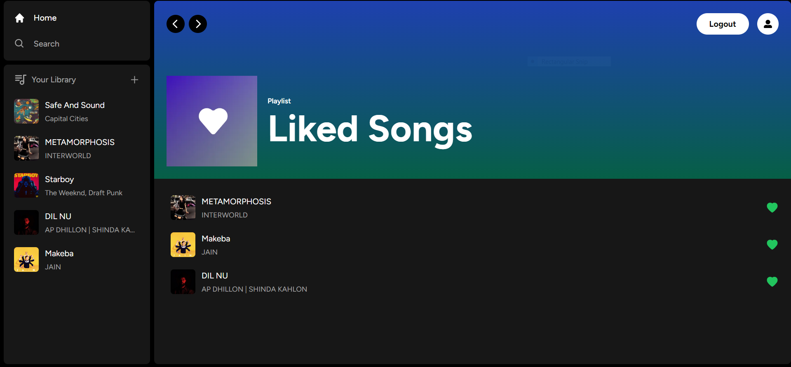

# Beatboxx | Music Web Application

Welcome to **Beatboxx**, a modern and fully responsive music streaming platform! This project brings users an experience akin to Spotify, allowing them to discover, stream, and upload their favorite tracks effortlessly. Built with Next.js 13, React, TypeScript, and Supabase, this app delivers a seamless user experience across all devices.

## Key Features

- **Stream Music**: Access an extensive library of songs across multiple genres, artists, and albums.
- **Upload Your Music**: Share your personal creations with the community.
- **Liked Library**: Save and organize your favorite tracks for easy access.
- **Subscription Plans**: Enjoy a free tier with one song upload, or upgrade to premium for unlimited uploads and exclusive features.
- **Payment Integration**: Integrated Stripe payment gateway (test mode) for easy and secure subscription upgrades.
- **User Authentication**: Robust sign-up and login features to access all app functionalities.
- **Player Controls**: Play, pause, adjust volume, and navigate between tracks seamlessly.
- **Responsive Design**: Fully responsive UI, offering an optimal experience on any screen size.


## Screenshots


 **Add songs by clicking on plus button in my library** 

Liked songs page


**Handle Subscription in my account**


**Full Responsive**


## Tech Stack

- **Next.js:** A React framework for server-side rendering and building scalable web applications.
- **React:** A popular JavaScript library for building user interfaces.
- **TypeScript:** A typed superset of JavaScript that enhances code quality and developer productivity.
- **Supabase:** An open-source Firebase alternative that provides a backend-as-a-service (BaaS) platform for data storage, authentication, and real-time functionalities.
- **Stripe:** A widely-used payment gateway for securely handling subscription payments and transactions.
- **Tailwind CSS:** A highly customizable CSS framework that provides utility classes for building responsive and modern user interfaces.
- **PostgreSQL:** An open-source relational database management system used for storing and managing the application's data.

## Installation

 1. Clone the repository:

 ```bash
  git clone https://github.com/adityayaduvanshi/Full-Stack-Music-Web-App.git
 ```
2. Install dependencies:    
```bash
 cd yourrepository
 npm install
```
3. Set up environment variables:  

 - Create a `.env.local` file in the root directory.
 - Add the following environment variables and replace the values with your own:
 ```bash
 NEXT_PUBLIC_SUPABASE_URL=your_supabase_url
 NEXT_PUBLIC_SUPABASE_ANON_KEY=your_supabase_anon_key
 SUPABASE_SERVICE_ROLE_KEY=your_supabase_service_role_key
 NEXT_PUBLIC_STRIPE_PUBLISHABLE_KEY=your_stripe_publishable_key
 STRIPE_SECRET_KEY=your_stripe_secret_key
 STRIPE_WEBHOOK_SECRET=your_stripe_webhook_secret
 ```
4. Add SQL Tables:

     Use `database.sql` file, create songs and liked_songs table 
 

5. Run the application:
```bash
npm run dev
```
6. Open your browser and visit `http://localhost:3000` to access the application.


